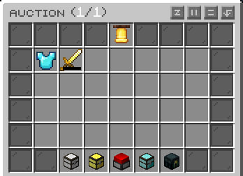

# Аукцион

Аукцион - плагин позволяющий игрокам торговать друг с другом находясь в разных точках сервера.&#x20;

:::info
Аукцион это глобальная торговая площадка объединяющая игроков.
:::

Чтобы открыть аукцион - необходимо прописать команду `/ah`

:::info
Все предметы которые продаются на аукционе на данный момент отображаются в первом открывшимся вам окне
:::

Чтобы купить предмет просто нажмите на него и подтвердите покупку в меню которое открылось.

По умолчанию вам доступно 5 слотов для размещения предметов на аукционе.

### 1. Продажа предметов.

Как же продавать на аукционе?

* Взять в руку предмет который вы хотите продать
* Прописать команду `/ah sell цена количество`
* После этих действий предмет автоматически попадет на аукцион и будет виден всем игрокам на сервере.

### 2. Политика размещения.

Как осуществляется работа аукциона?

* После того, как вы выставили предмет на аукцион, автоматически начинается отсчет в 48 часов, по истечению которого предметы будут помещены в просроченные в случае если их не купили
* За то, что вы выставили предмет на продажу, взимается комиссия в сколько там диняк.
