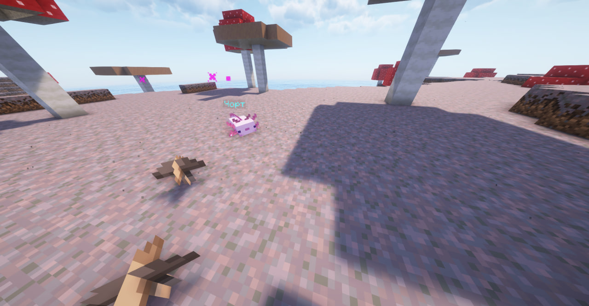
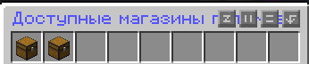
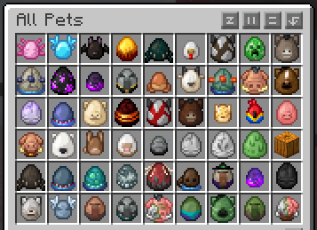
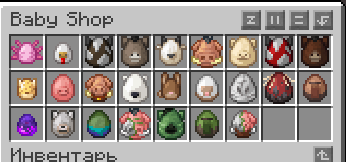
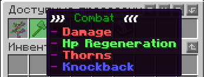
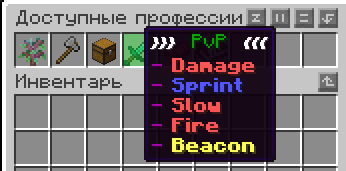

# Питомцы

Питомцы это ваши верные союзники и помощники в мире **Bakato**

На нашем сервере присутствует плагин на питомцев, каждый питомец имеет дерево навыков и уровни прокачки, на данный момент они не уникальны, различаются только сами животные.

### Покупка питомца

Чтобы посмотреть или купить доступных петомцев - пропишите команду `/petshop`

### Прокачка питомца

Чтобы прокачать вашего питомца необходмо вобрать один из двух боевых навыков **Combat** или **PvP** (на данный момент перевод делается). &#x20;

Чтобы открыть дерево навыков вам необходимо прописать команду `/pcst` после чего выбрать понравившийся навык и после этого питомец приобретет необходимые вам способности и бафы.
