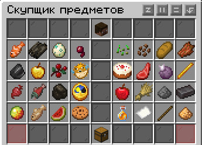
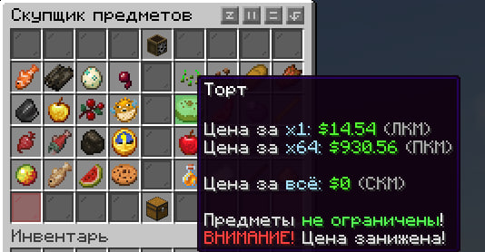

# Скупщик

PrimeSeller - интересный плагин реализующий заработок на сервере, один из немногих плагинов который позволяет вам торговать ресурсами.

:::tip
Скупщик практически полностью закрывает ваши потребности в первоначальном заработке
:::

Чтобы начать торговать со скупщиком, необходимо прописать команду `/seller`

Интерфейс скупщика выглядит интуитивно понятно и просто

:::info
По наведению мыши можно узнать прайс по которому скупщик скупает те или иные ресурсы и предметы
:::

## Скупщик делится на два вида предметов:

### 1. Продажа предметов без лимита на количество проданных предметов.

:::info
Цена на такие предметы и ресурсы меняется динамически, от количества проданных предметов, цена зависит от того как торгует со скупщиком ВЕСЬ СЕРВЕР.
:::

### 2. Продажа предметов с лимитом.

:::info
Цена обычно достаточно высока, однако количество продаваемых предметов на игрока ограничено.
:::
